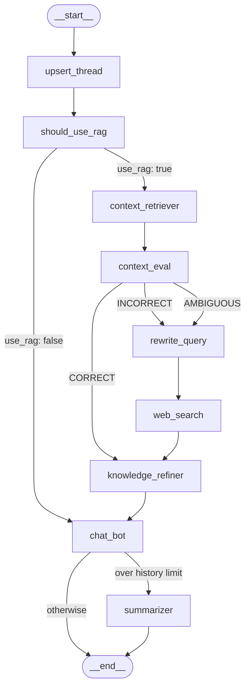

# C-RAG

A production-ready Retrieval-Augmented Generation (RAG) API built with FastAPI, LangGraph, PostgreSQL + pgvector, and Google Gemini.

## Overview

C-RAG lets users upload PDF documents and chat with them through a streaming conversational interface. Document ingestion runs in the background via Celery workers. The chat pipeline is a multi-stage LangGraph state graph: it retrieves context from stored document chunks, evaluates chunk relevance, falls back to live web search (via Tavily) when needed, refines the context sentence-by-sentence, then streams the final answer.

## Architecture

### RAG Pipeline



### System Overview

```
┌─────────────────────────────────────────────────────────┐
│                        FastAPI App                      │
│  ┌──────────────┐  ┌──────────────┐  ┌───────────────┐  │
│  │  /v1/docs    │  │  /v1/threads │  │  /v1/health   │  │
│  └──────┬───────┘  └──────┬───────┘  └───────────────┘  │
│         │                 │                             │
│  ┌──────▼───────┐  ┌──────▼──────────┐                  │
│  │Doc Controller│  │Thread Controller│                  │
│  └──────┬───────┘  └──────┬──────────┘                  │
└─────────┼─────────────────┼─────────────────────────────┘
          │                 │
          ▼                 ▼
┌─────────────────┐  ┌─────────────────────┐  ┌──────────────────────┐
│  Celery Worker  │  │  LangGraph Pipeline  │  │  PostgreSQL+pgvector │
│  (PDF ingestor) │  │  (see graph above)   │  │  users | threads     │
│                 │  │                     │  │  messages | documents │
│  load → chunk   │  │  checkpointed to DB  │  │  chunks (HNSW index) │
│    → embed      │  │  keyed by thread_id  │  │                      │
│    → store      │  │                     │  │                      │
└─────────────────┘  └─────────────────────┘  └──────────────────────┘
```

## Tech Stack

| Layer | Technology |
|---|---|
| API Framework | FastAPI + Uvicorn |
| LLM / Embeddings | Google Gemini (via `langchain-google-genai`) |
| RAG Pipeline | LangGraph |
| Vector Search | pgvector (cosine distance, HNSW index) |
| Web Search Fallback | Tavily (via `langchain-tavily`) |
| Database | PostgreSQL (async via SQLAlchemy + asyncpg) |
| Migrations | Alembic |
| Background Tasks | Celery + Redis (`celery-aio-pool` for async tasks) |
| Package Manager | uv |

## Prerequisites

- Python 3.12+
- Docker (for PostgreSQL + Redis)
- A Google Gemini API key
- A Tavily API key (for web search fallback)

## Setup

**1. Clone and install dependencies**

```bash
git clone <repo-url>
cd c-rag
uv sync
```

**2. Start infrastructure**

```bash
docker compose up -d
```

This starts:
- PostgreSQL with pgvector on port `5432`
- Redis on port `6379`

**3. Configure environment**

Create a `.env` file in the project root:

Copy `.env.example` to `.env` and fill in the required values:

```env
# App
ENV=local
CORS_ALLOWED_URL=http://localhost:3000

# Database
DB_HOST=localhost
DB_PORT=5432
DB_NAME=c_rag
DB_USER=postgres
DB_PASSWORD=postgres

# Redis
REDIS_URL=redis://localhost:6379/0

# Gemini
GEMINI_API_KEY=your-api-key-here
GEMINI_MODEL=gemini-2.0-flash
GEMINI_EMBEDDING_MODEL=models/text-embedding-004
GEMINI_IMAGE_MODEL=gemini-2.0-flash

# Web search fallback
TAVILY_API_KEY=your-tavily-key-here

# RAG settings
EMBEDDING_DIM=768
EMBEDDING_BATCH_SIZE=10
MAX_CHAT_HISTORY=6

# Context evaluation thresholds (0.0–1.0)
CONTEXT_EVAL_HIGHER_THR=0.7
CONTEXT_EVAL_LOWER_THR=0.3
```

> `EMBEDDING_DIM` must match the output dimensionality of your embedding model:
> - Gemini `text-embedding-004`: `768`
> - OpenAI `text-embedding-3-small`: `1536`
> - OpenAI `text-embedding-3-large`: `3072`

**4. Run the API server**

```bash
uv run uvicorn app.main:app --reload
```

Migrations run automatically on startup. The API is available at `http://localhost:8000`.

**5. Run the Celery worker**

In a separate terminal:

```bash
uv run celery -A app.celery_app worker --loglevel=info
```

## API Reference

All routes are prefixed with `/v1`.

### Documents — `/v1/docs`

| Method | Path | Description |
|---|---|---|
| `POST` | `/v1/docs/ingest` | Upload a PDF for background ingestion |
| `GET` | `/v1/docs/` | List all documents for the current user |
| `GET` | `/v1/docs/{document_id}` | Get a specific document |
| `DELETE` | `/v1/docs/` | Delete a document and its chunks |

**Ingest a document:**
```bash
curl -X POST http://localhost:8000/v1/docs/ingest \
  -F "file=@report.pdf"
```

The response returns HTTP 202 immediately. The file is saved locally under `app/uploads/` and the Celery worker handles chunking, embedding, and storage asynchronously. Document status can be `processing`, `completed`, or `failed`.

### Threads / Chat — `/v1/threads`

| Method | Path | Description |
|---|---|---|
| `GET` | `/v1/threads/` | List all conversation threads |
| `GET` | `/v1/threads/{thread_id}/` | Get messages for a thread |
| `POST` | `/v1/threads/{thread_id}/query` | Send a query (streaming response) |

**Send a query:**
```bash
curl -X POST http://localhost:8000/v1/threads/{thread_id}/query \
  -H "Content-Type: application/json" \
  -d '{"query": "What is the main finding in the report?"}'
```

The response is a `text/plain` streaming response — tokens are pushed as they are generated.

### Health — `/v1/health`

```
GET /v1/health
```

## RAG Pipeline (LangGraph)

Each query flows through these nodes:

1. **`upsert_thread`** — creates the thread record on first message, generates a title using the LLM
2. **`should_use_rag`** — routes the query: asks the LLM whether the question requires document retrieval or can be answered from general knowledge / chat history
3. **`context_retriever`** — embeds the query and runs a cosine similarity search over `chunks`, fetching the top-5 matching chunks for the user
4. **`context_eval`** — scores each retrieved chunk against the question using a structured LLM call. Produces a verdict:
   - `CORRECT` (any chunk score > `CONTEXT_EVAL_HIGHER_THR`) → proceed to `knowledge_refiner`
   - `INCORRECT` (all chunks score < `CONTEXT_EVAL_LOWER_THR`) → fall back to web search
   - `AMBIGUOUS` (mixed scores, no chunk clears the high bar) → fall back to web search
5. **`rewrite_query`** — rewrites the user question into a short keyword-based web search query (6–14 words)
6. **`web_search`** — calls Tavily to fetch up to 3 live web results as `Document` objects
7. **`knowledge_refiner`** — decomposes the context into sentences, filters each sentence with the LLM (`keep=true/false`), and recomposes only the relevant sentences into `refined_context`
8. **`chat_bot`** — assembles the prompt using `refined_context`, streams the response token-by-token via an `asyncio.Queue`, and persists both messages to the database
9. **`summarizer`** — triggered when message count exceeds `MAX_CHAT_HISTORY`; compresses old messages into a rolling summary

Graph state is persisted in PostgreSQL via `langgraph-checkpoint-postgres`, so conversations survive server restarts.

## Document Ingestion Pipeline

When a PDF is uploaded:

1. The file is saved to `app/uploads/`
2. A `Document` record is created in the database with status `processing`
3. A Celery task (`ingest_document`) is dispatched
4. The worker loads the PDF with `PyPDFLoader`, splits it into chunks (~1000 chars, 100 overlap), embeds each batch with Gemini, and stores `Chunk` records with their vector embeddings
5. The document status is updated to `completed` or `failed`

Rate-limit retries are built in: embedding batches use exponential backoff (4–60s, up to 5 attempts).

## Authentication

Authentication is currently stubbed. Private and admin routes (`/private`, `/admin`) automatically attach the seeded admin user — actual token validation is marked as a TODO in `app/middlewares/auth.py`. Internal service-to-service routes (`/internal`) validate a bearer token against `INTERNAL_TOKEN`.

## Database Schema

| Table | Purpose |
|---|---|
| `users` | User accounts (seeded with one admin via migration) |
| `threads` | Conversation threads, owned by a user |
| `messages` | Individual chat messages with role, content, token counts, and latency |
| `documents` | Uploaded files with ingestion status |
| `chunks` | Text chunks with 768-dim vector embeddings (HNSW index) |
| `message_citations` | Links messages to the chunks that informed them |

## Project Structure

```
app/
├── main.py                  # FastAPI app, lifespan, middleware wiring
├── celery_app.py            # Celery configuration
├── api/
│   ├── routers/             # Route definitions (document, thread, health)
│   ├── controller/          # Business logic layer
│   ├── models/              # Pydantic request/response schemas
│   └── utils/               # Response helpers, datetime utils
├── bot/
│   ├── state.py             # RAGState (LangGraph MessagesState extension)
│   ├── llm.py               # Gemini LLM instance
│   └── nodes/               # Graph nodes: router, retriever, context_eval, web_search, knowledge_refiner, generator, summarizer
├── rag/
│   ├── graph.py             # LangGraph StateGraph definition
│   ├── retriever.py         # Embedding + similarity search
│   └── ingestor/            # Abstract base + PDF ingestor
├── db/
│   ├── client.py            # SQLAlchemy async engine + session factory
│   ├── models/              # ORM models
│   └── services/            # DB service layer (CRUD + domain queries)
├── worker/
│   └── tasks.py             # Celery task: ingest_document
├── middlewares/
│   ├── auth.py              # Bearer token / user attachment
│   └── api_trace.py         # Request tracing
├── core/
│   ├── config.py            # Pydantic settings (reads .env)
│   ├── logging.py           # Logger setup
│   └── exception_handlers.py
└── constants/
    ├── enums.py             # RouteType, UserRole, MessageRoleEnum, DocumentStatusEnum
    └── constants.py         # Shared string constants
```